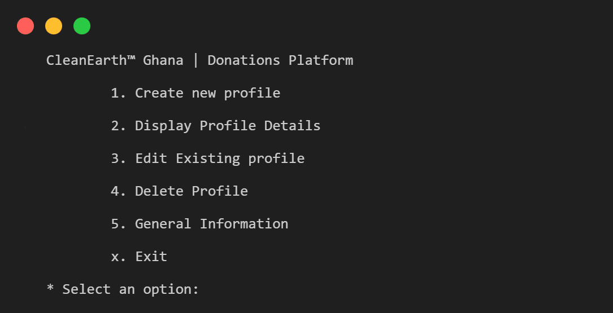

# Donation Program

This Python program is mainly focused on Object-Oriented-Programming. The program allows the user to manage donor profiles for the CleanEarth Ghana. It provides functionalities to create new profiles, view existing profiles, edit profile details, delete profiles, and view general donation information.

## Features:

- **Create new donor profiles:** Enter details like name, age, occupation, and donation amount to create a new profile. Each profile is assigned a unique random ID for identification.
- **Search for profiles:** Search for profiles by ID or name (case-insensitive).
- **Edit existing profiles:** Modify details such as name, age, occupation, and donation amount.
- **Delete profiles:** Remove a donor profile from the system.
- **View general donation information:** Check the total amount donated and the totl number of donors.

## Getting Started

### Prerequisites:

- Python 3.0 or above installed on your system.

### Running the program:

1. Clone this repository to your local machine.
2. Navigate to the cloned directory using the `cd` command in your terminal (e.g., `cd donations.py`).
3. Run the program using the following command:
    ```bash
    python donations.py
    ```

## Using the Program

The program presents a menu-driven interface. Select the desired option by entering the corresponding number:

1. **Create new profile:** Enter donor details to create a new profile.
2. **Display Profile Details:** Choose to search for a profile by ID or name.
3. **Edit Existing Profile:** Enter the profile ID to edit details.
4. **Delete Profile:** Enter the profile ID to delete the profile.
5. **General Information:** View the total amount donated and the number of donors.
6. **Exit (x):** Exit the program.
   
<a href="interface.png" ></a>


### DISCLAIMER: 
The organization featured in this program is purely fictional. 
Rest assured, it's a figment of imagination created solely for the purpose of this code :)

## Additional Notes

- The program uses Object-Oriented Programming (OOP) concepts to manage donor profiles as objects.
- Data validity is ensured by prompting the user to re-enter donation amounts if invalid input is provided (non-numeric values).

## Author
[Oswald Amoah](https://lnk.bio/oswaldamoah)
